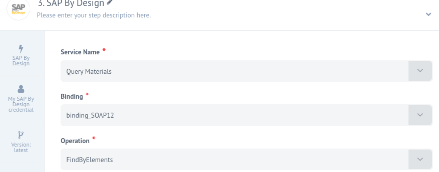

## Description

An iPaaS component that provides an opportunity to interact with SAP byDesign API.
SAP byDesign API integration with {{site.data.tenant.name}}

### Purpose

As an iPaaS platform {{site.data.tenant.name}} must have an opportunity to interact
with SAP Business byDesign API.

## Requirements

### Environment variables

| Name | Mandatory | Description | Values |
|---------------------|-------|-----------------------------------|-----------------------------------------------|
| LOG_LEVEL           | false | Log Level. Default value (`INFO`) | `FATAL` `ERROR` `WARN` `INFO` `DEBUG` `TRACE` |
| EIO_REQUIRED_RAM_MB | false | Value of allocated memory         | `2048` recommended                            |

### Credentials

| Property name | Required | Description | Example|
|-------------|--------|-------------------------------------|--------------|
| Service URL | true   | `https://my3443532.sapbydesign.com` |              |
| Username    | true   | Username for authentication         | `sapAdmin`   |
| Password    | true   | Password for authentication         | `adminPassw` |

**Important:** User should have access rights to get WSIL service descriptor and rights to call a service operation which was specified during the `Call Service` configuration.

## Triggers

### Get New And Updated Objects Polling

The configuration fields are:

1.  `Polling Object` - objects that going to be polled by the trigger.
2.  `Emit Behaviour` - `Fetch All` emit all polled objects in one message, `Emit Individually` creates separate message for each object.
3.  `Polling Type` - `Created` poll for created objects, `Updated` poll for updated objects.
4.  `Size Of Polling Page` - the maximum number of objects retrieved by one poll call.
5.  `Start Datetime Of Polling` - the start datetime of polling in the iso format.

#### Supported Objects

At the moment only few object types are supported:

1.  Query Materials
2.  Query Sales Orders
3.  Query Accounts

## Actions

### Call Service

Calls SAP byDesign service for specified binding and operation. The configuration
fields are:

| Input field | Required | Description | Example|
|--------------|------|----------------------------------|------------------|
| Service Name | true | Service of SAP By Design to call | `Query Accounts` |
| Binding      | true | SOAP Service binding             | `binding_SOAP12` |
| Operation    | true | SOAP Service operation           | `FindByElements` |


## Request examples

1.  Query Accounts 

Example in metadata:

```json
{
    "CustomerByElementsQuery_sync": {
      "customerSelectionByElements": {
        "selectionByCreationDateTime": [
          {
            "inclusionExclusionCode": "I",
            "intervalBoundaryDateTime": "7",
            "upperBoundaryDateTime": "2019-01-01T00:00:00Z"
          }
        ]
      },
      "processingConditions": {
        "queryHitsMaximumNumberValue": 2,
        "queryHitsUnlimitedIndicator": false
      }
    }
}
```
2.  Query Price Lists 

Example in metadata:
```json
{
    "SalesPriceListFindByTypeCodeAndPropertyIDAndPropertyValueQuery_sync": {
      "salesPriceList": {
        "lastChangedDatetimeInterval": {
          "lowerBoundaryDateTime": "2001-01-01T00:00:00Z",
          "upperBoundaryDateTime": "2019-01-01T00:00:00Z"
        }
      }
    }
}
```
3.  Query Sales Orders .
Example in metadata:
```json
 {
    "SalesOrderByElementsQuery_sync": {
      "salesOrderSelectionByElements": {
        "selectionByLastChangedDate": [
          {
            "inclusionExclusionCode": "I",
            "IntervalBoundaryTypeCode": "7",
            "upperBoundaryDateTime": "2019-01-01T00:00:00Z"
          }
        ]
      },
      "processingConditions": {
        "queryHitsMaximumNumberValue": 2,
        "queryHitsUnlimitedIndicator": false
      }
    }
 }
```
4.  Query Materials 

Example in metadata:
```json
{
    "MaterialByElementsQuery_sync": {
      "materialSelectionByElements": {
        "SelectionByLastChangeSinceDateTime": "2001-01-01T00:00:00Z"
      },
      "processingConditions": {
        "queryHitsMaximumNumberValue": 2,
        "queryHitsUnlimitedIndicator": false
      }
    }
}
```

5.  Product Availability (Available To Promise Check) 

Example in metadata:
```json
{
    "ProductAvailabilityDeterminationQuery_sync": {
      "productAvailabilityDeterminationQuery": {
        "productAndSupplyPlanningArea": [
          {
            "supplyPlanningAreaID": {
              "value": "P1100"
            },
            "productInternalID": {
              "value": "P100101"
            },
            "productTypeCode": "1"
          }
        ],
        "productAvailabilityDeterminationHorizonDuration": "P2D",
        "considerScopeOfCheckIndicator": false
      }
    }
  }
```


## Limitations

version: 2.1.1

1.  Polling trigger only supports `Query Materials`, `Query Accounts`, `Query Sales Orders` objects.
2.  Due to a platform feature `retrieving sample` timeout a sample may not be retrieved during the component setup process. It is not a bug as it is caused by a heavy-weight Java process for serialization/deserialization of JAXB structure for SAP's WSDL. Which is normally of huge size. We are hardly working on this issue and it will likely be fixed in the nearest releases. But for now please be patient. As this issue is only for UI retrieve sample functionality it will NOT affect you in runtime.

## License

© [{{site.data.tenant.name}} GmbH](https://www.{{site.data.tenant.name}})
