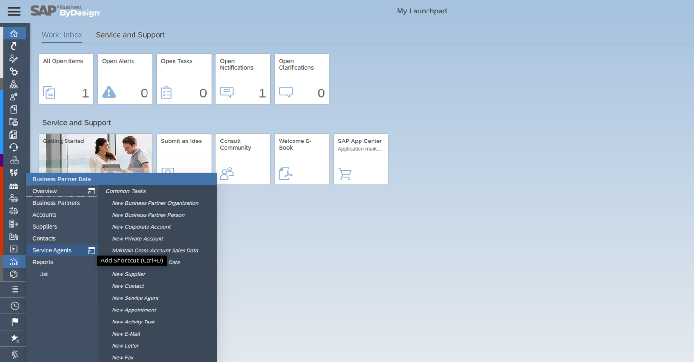
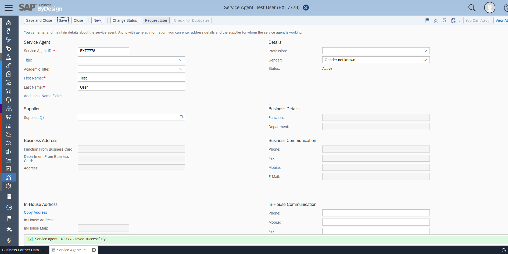
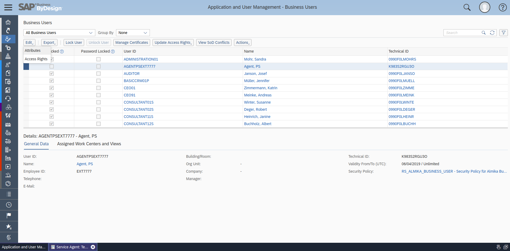
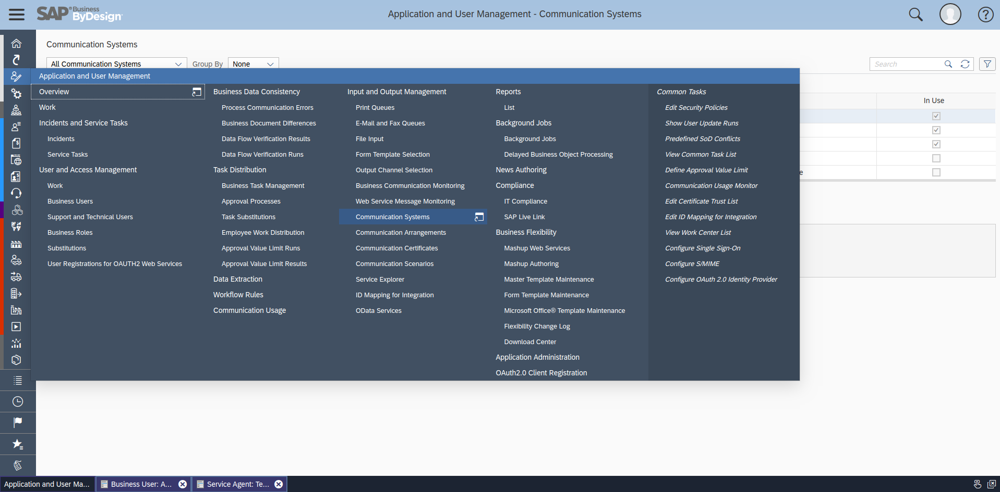
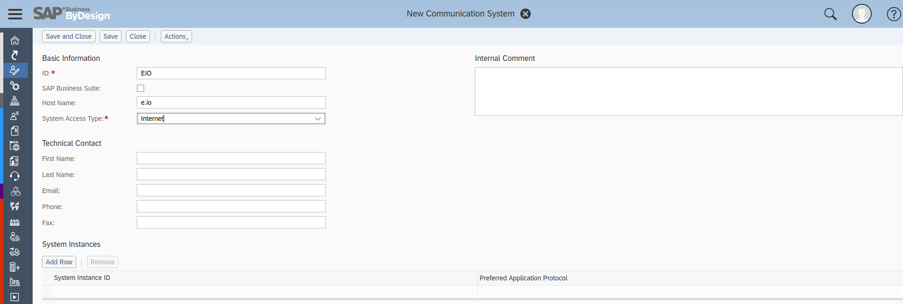
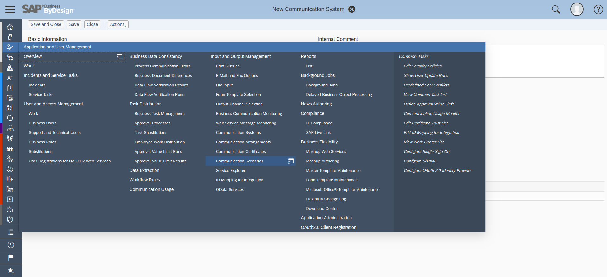
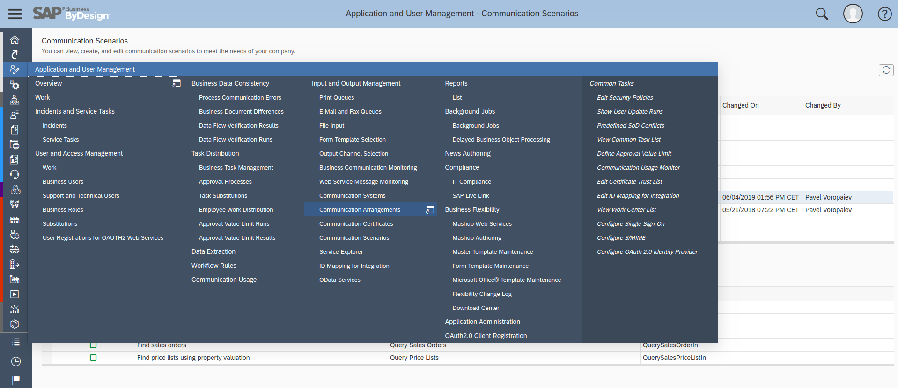
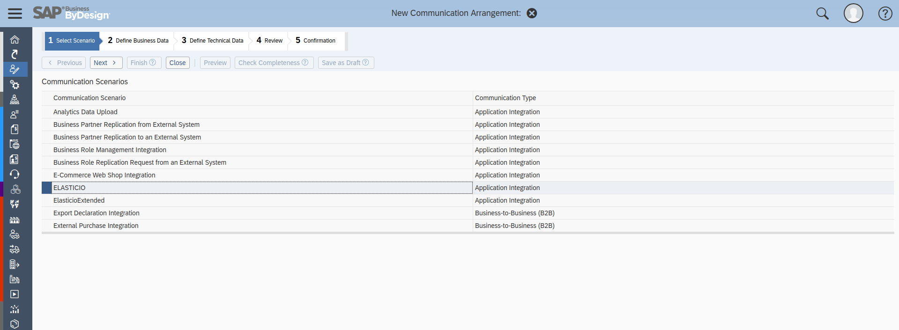
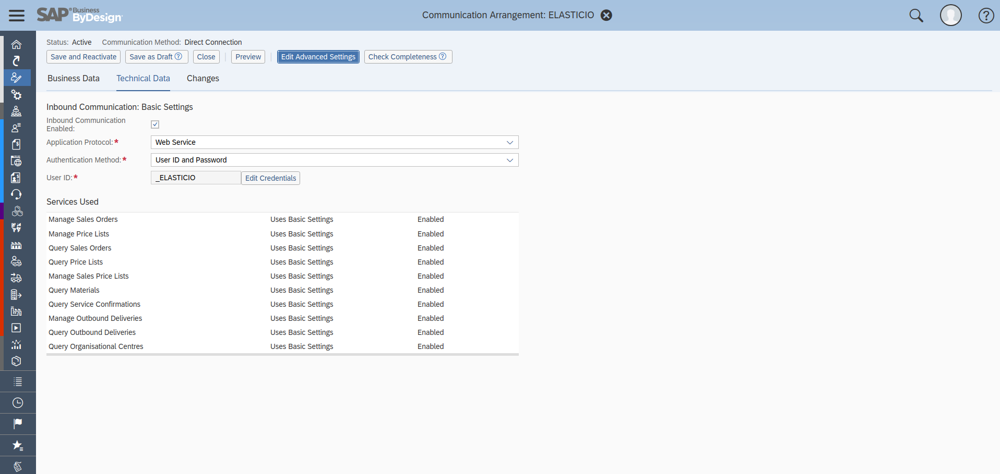

This document will guide you to get access to Web Service consuming from SAP Business ByDesign.

## Creating user

First we need to create a user for web services communication:

1.  Open your SAP instance (`https://myXXXXXX.sapbydesign.com`), log in as admin user and navigate to *New Service Agent* menu   .
2.  Fill all the required fields out and Save. Right after saving click *Request User* .
3.  Navigate to Application and User Management -> Business Users. Choose your new requested user and edit Attributes and Access Rights. You should generate and save a new password for the user.   In the Access Right edit session assign all the needed rights under the *Work Center and View Assignment* tab  This user's login and password should be used for authentication in the {{site.data.tenant.name}} SAP ByDesign component.

## Setting communication

Now we need to setup the communication system for the web services interactions:

1.  First you need to create a new communication system   And set it as active (Actions -> Set to Active)
2.  Next create a new Communication Scenario and check needed operations as Added 
3.  You have to create a new communication arrangement if you don´t have any in your system. (Jump to the next step if you have)  
4.  If you already have or created one, choose the communication arrangement you created and click on *Edit* and open *Technical Data* tab. Click on *Edit Advanced Settings*. There you can download `WSDL`.  
